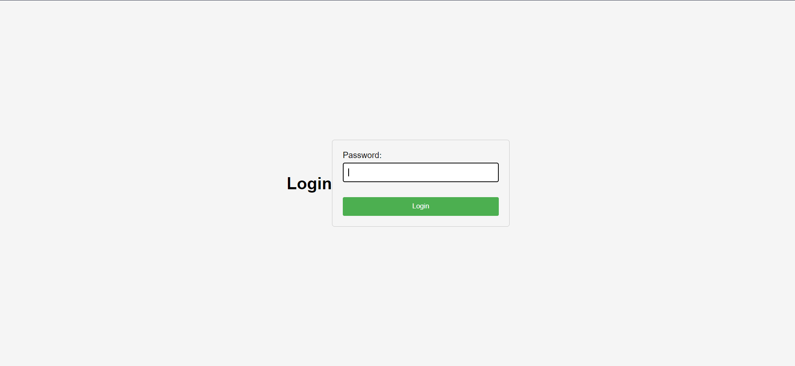
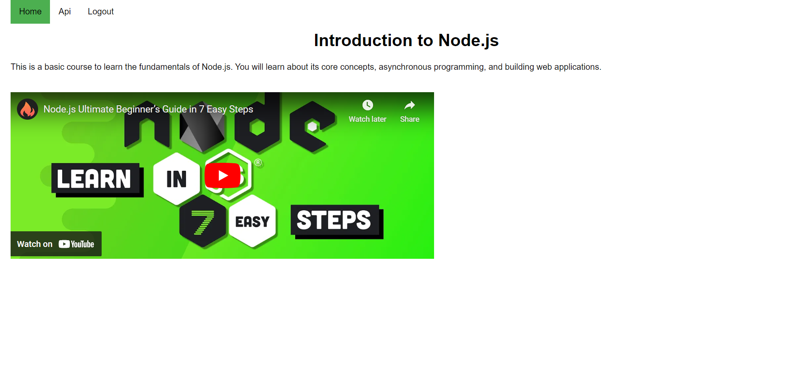

# Node Express Project

This repository contains a Node.js project built with the Express framework. It serves as a boilerplate or a starting point for building web applications using Node.js and Express.

## Features

- **Express Framework**: Utilizes the popular Express.js framework for building web applications.
- **Routing**: Demonstrates basic routing for handling different HTTP requests.
- **Middleware**: Includes middleware for handling requests, such as logging and error handling.
- **Modular Structure**: Follows a modular structure for organizing code into different modules.

## Project Link

- To access project in browser: https://lms-course-api.onrender.com

## Directory Structure

- `index.js`: Entry point of the application.
- `routes/`: Contains route definitions.
- `controllers/`: Contains controller functions for handling route logic.
- `middlewares/`: Contains custom middleware functions.
- `public/`: Contains static files such as stylesheets, etc.

##Project
- This is a project that has a basic course api

